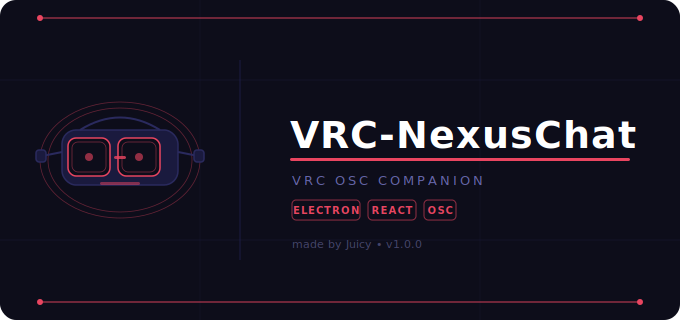

# VRC-NexusChat

<div align="center">


**VRC-NexusChat is an app that helps you send messages show your local time display your Spotify music and control your VR HUD and much more. All from one simple desktop app.**

[Download](#installation) · [Features](#features) · [Support](#support) · [Legal](#legal-notice)

</div>



> [!IMPORTANT]

> Please make sure to **enable OSC** inside VRChat before using VRC-NexusChat.

> Without OSC enabled the app will not be able to talk to VRChat.

## What is VRC-NexusChat?

VRC-NexusChat is an app that connects your PC to VRChat.

It helps you send messages show your time and control VRChat features. All from your desktop.

VRC-NexusChat uses **Electron** **React**. *TypeScript** for a fast experience.

## Installation

> [!NOTE]

> VRC-NexusChat works on **Windows 10 or 11**.

- Download the latest **[Release](../../releases)** ZIP file

- Extract the ZIP into a folder

- Run `VRC-NexusChat.exe`

- Enable OSC in VRChat *(Action Menu → Options → OSC → Enable)*

- You are done. Enjoy!

## Features

> [!NOTE]

> VRC-NexusChat is always getting better. New features are added often!

| Feature | Status | Description |

|---|---|---|

|  Chatbox |  Available | Send custom messages to your VRChat Chatbox |

Local Time.  Available | Show your local time in VRChat |

|  Spotify |  Coming Soon | Show your song in VRChat |

|  HUD Settings |  Coming Soon | Customize your VR HUD |

|  Weather |  Planned | Show weather in your Chatbox |

|  AFK Module |  Planned | Set AFK status automatically |

## How It Works

```

VRC-NexusChat  →  OSC (UDP Port 9000)  →  VRChat Chatbox

```

VRC-NexusChat sends OSC messages to VRChat on your PC.

No internet is needed. Everything runs locally.

The HUD works without software

## Built With

| Technology | Purpose |

|---|---|

| [| Desktop App Framework |

| [React](https://react.dev/) | UI Framework |

| [TypeScript](https://www.typescriptlang.org/) | Type-safe JavaScript |

| [osc.js](https://github.com/colinbdclark/osc.js/) | OSC Communication |

## Support

> [!NOTE]

> Need help? More support options are coming soon!

If you have issues:

-  **Bug?** Open an **[Issue](../../issues)** on GitHub

-  **Feature Request?** Open a **[Discussion](../../discussions)** on GitHub

## Roadmap

- [x] Chatbox messaging

- [x] Local time display

- [ ] Spotify integration

- [ ] HUD customization

- [ ] Better Overlay

- [ ] Settings

- [ ] Weather display

- [ ] AFK module

- [ ] Auto-updater

## Legal Notice

> [!IMPORTANT]

> VRC-NexusChat uses a **custom license**.

> The source code is public for transparency. *No permission is granted** to copy, modify or create derivative works without permission, from the author.

By downloading or using VRC-NexusChat you agree to these terms.

## Disclaimer

VRC-NexusChat is a project and is **not affiliated with VRChat Inc.**

All product names, logos and brands are property of their owners.

VRChat is a trademark of VRChat Inc.

<div align="center">

Made with ❤️ by **Juicy**

2026 VRC-NexusChat. All Rights Reserved

</div>
